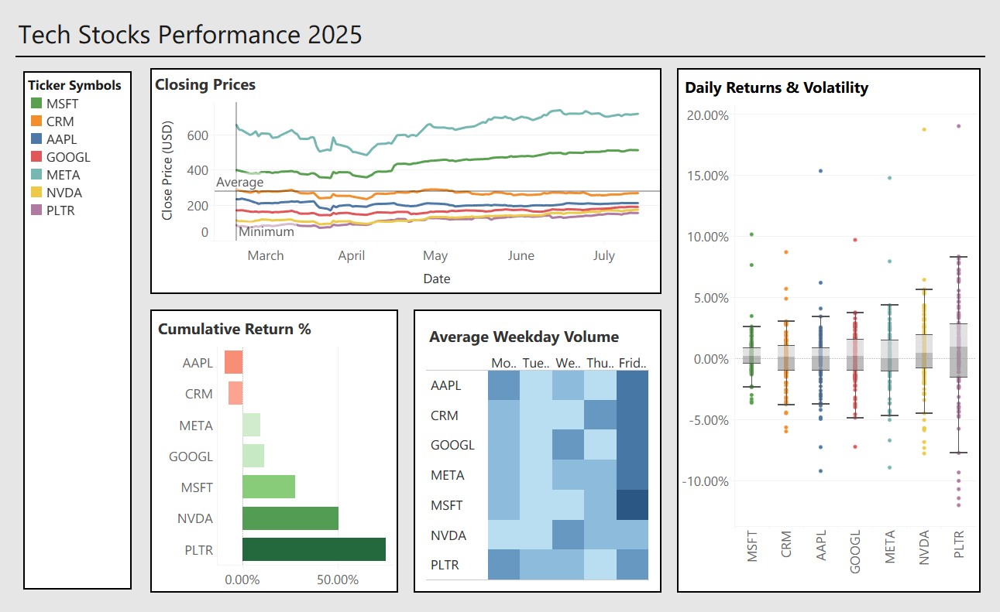

# 📈 Tech Stocks Performance Dashboard (March–July 2025)

An interactive Tableau dashboard analyzing 7 major tech stocks — AAPL, NVDA, PLTR, MSFT, META, GOOGL, CRM — across performance, volatility, and trading volume from March to July 2025.

## 🔍 Key Features

- **Normalized Closing Prices** — Compare all stocks relative to March 1 starting value.
- **Cumulative Returns Bar Chart** — Visualize each stock’s total percentage gain/loss.
- **Boxplots of Daily Returns** — Explore volatility across stocks.
- **Weekday Volume Heatmap** — Identify which stocks spike on which days.

## 🛠️ Tools Used
- **Tableau** — Interactive dashboards & visualizations  
- **Excel/CSV** — Data preparation  
- **Alpha Vantage API** — Source for stock data

## 📎 Dashboard Preview

## 📬 Key Insights
- 📈 **PLTR** had the strongest performance, returning over 75%; However is the most volatile stock
- 🧊 **MSFT** was the most stable stock with the lowest volatility.
- 🔥 **NVDA** showed high volume spikes, especially mid-week.
- 📉 Volume surges often aligned with large price movements.

## 🚀 Live Dashboard
👉 [View on Tableau Public](https://public.tableau.com/views/Stocks_Dashboard_17538357124920/PerformanceDashboard)

## 🧑‍💼 About the Author
**Trevor Smith** — Data Analytics/Science Student @ University of Arizona  
📫 [LinkedIn](https://www.linkedin.com/in/trevorsmith00)
